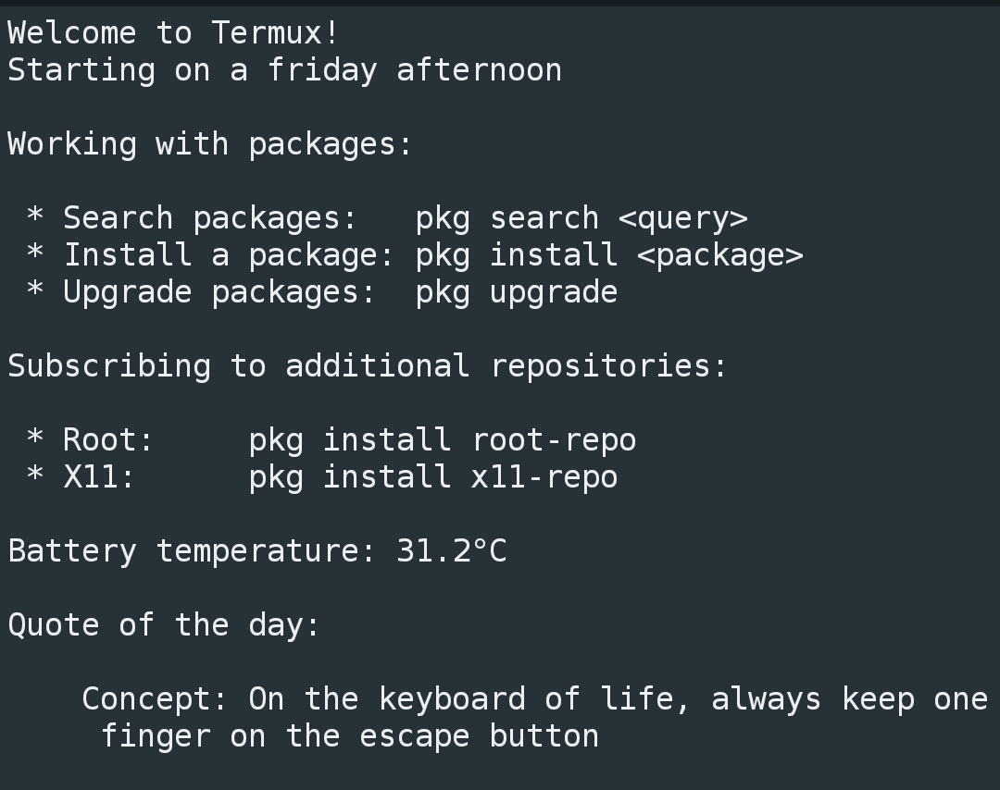

# Termux-MOTD



A custom python script for giving the [Termux][1]
terminal emulator a dynamic message of the day.

## Requirements

- Python 3.10 or above (`pkg install python`)
- [Termux API 0.50.1][2] or above

## Installation

1. Clone this repository to the 
   /data/data/com.termux/files/usr/etc/ directory

2. In the same etc/ directory, add this line to
   the termux-login.sh file:

   ```sh
   (cd /data/data/com.termux/files/usr/etc/termux_motd && python3 -m src.motd)
   ```

3. Rename etc/motd to something else (e.g. motd.bak)
   so Termux does not display it

## Customization

The "quote of the day" is taken from jokes.txt,
which can be edited to show quotes you want to see.

Sections of the MOTD can be edited near the top
of the `__main__.py` script.

## Using outside of Termux

This script *can* run in a desktop environment
without modifications, but Termux-related features
will not be available. To prevent the associated
warnings from showing, set the `TERMUX_API` variable
in the script to `False`.

## License

This project is using the [MIT License](LICENSE).

[1]: https://f-droid.org/en/packages/com.termux.api/
